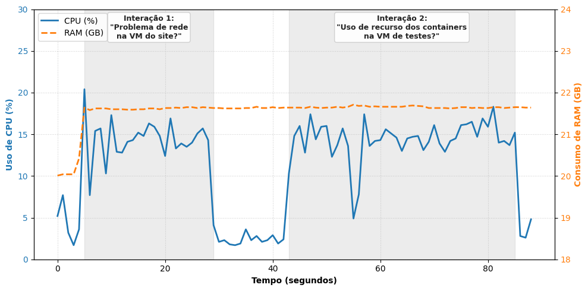

&nbsp;
&nbsp;

<p align="center">
  
</p>

# Monitoramento de Infraestruturas Computacionais via Agente Conversacional: Uma Abordagem Experimental

### Autores: [Erick Justino](https://github.com/erickjustino), [Marianne Silva](https://github.com/MarianneDiniz), [Carlos M. D. Viegas](https://github.com/cmdviegas), [Dennis Brandão](https://scholar.google.com.br/citations?user=OxSKwvEAAAAJ&hl=pt-BR&authuser=1&oi=ao) e [Ivanovitch Silva](https://github.com/ivanovitchm)

Este repositório reúne a implementação de um agente conversacional para apoiar o
monitoramento de infraestruturas computacionais a partir de perguntas em
linguagem natural. A solução integra um modelo de linguagem executado localmente
com ferramentas Python especializadas em consultar métricas no Prometheus.

A ideia principal é reduzir a dependência de consultas manuais em PromQL durante
investigações operacionais. O operador faz perguntas sobre máquinas virtuais,
contêineres, uso de CPU, memória, disco, rede ou anomalias, e o agente seleciona
a ferramenta adequada, consulta o Prometheus e retorna uma resposta fundamentada
nos dados observados.

## Visão Geral

A arquitetura experimental segue três módulos principais:

1. **Instrumentação**: coleta de métricas em máquinas virtuais por meio do Node
   Exporter e de métricas de contêineres por meio do cAdvisor.
2. **Monitoramento**: armazenamento e consulta das séries temporais no
   Prometheus.
3. **Inteligência**: agente conversacional local baseado em LLM, LangChain,
   Ollama e ferramentas Python para consulta e interpretação das métricas.

O fluxo geral é:

1. O usuário envia uma pergunta em linguagem natural pela interface de linha de
   comando.
2. O modelo local interpreta a intenção e seleciona uma ferramenta.
3. A ferramenta executa uma consulta PromQL no Prometheus.
4. Os dados retornados são estruturados e resumidos.
5. O agente responde apenas com informações fundamentadas nas métricas coletadas.

## Estrutura do Repositório

```text
.
├── agent/
│   ├── __init__.py
│   ├── engine.py
│   ├── prompt.py
│   └── tools.py
├── core/
│   ├── __init__.py
│   ├── config.py
│   └── utils.py
├── figures/
│   └── grafico-overhead.pdf
├── services/
│   ├── metrics.py
│   └── prometheus.py
├── .gitignore
├── main.py
├── requirements.txt
└── README.md
```

## Arquivos

- `main.py`: interface de linha de comando do agente.
- `agent/engine.py`: criação do LLM local, prompt, memória conversacional e
  executor LangChain.
- `agent/prompt.py`: instruções de sistema, regras de uso das ferramentas e
  restrições contra alucinação.
- `agent/tools.py`: ferramentas expostas ao agente para consultas de VM,
  contêineres, anomalias e PromQL bruto.
- `core/config.py`: variáveis de ambiente, limiares operacionais e catálogo de
  alvos monitorados.
- `core/utils.py`: funções auxiliares de formatação, média, máximo e
  classificação por limiar.
- `services/prometheus.py`: cliente HTTP para a API do Prometheus e extratores de
  resultados.
- `services/metrics.py`: consultas PromQL e consolidação das métricas de VM e
  contêineres.
- `figures/grafico-overhead.pdf`: figura com o consumo de CPU e memória durante
  a execução local do agente.
- `requirements.txt`: dependências Python do projeto.

## Abordagem

O agente foi projetado como uma camada interpretativa entre o operador e o
Prometheus. Em vez de expor apenas valores brutos, o sistema organiza os dados em
respostas curtas e operacionais, indicando estado geral, médias, picos e sinais
de degradação.

A execução local do modelo busca preservar a soberania dos dados operacionais,
evitando o envio de métricas, topologias ou informações sensíveis da
infraestrutura para provedores externos.

### Ferramentas do Agente

| Ferramenta | Finalidade |
| --- | --- |
| `tool_obter_saude_vm` | Consulta saúde geral ou métricas específicas da máquina virtual. |
| `tool_obter_saude_containers` | Consulta saúde, CPU, memória, ranking e anomalias de contêineres. |
| `tool_detectar_anomalias` | Consolida sinais de alerta da VM e dos contêineres. |
| `prom_consulta_instantanea` | Executa PromQL cru usando `/api/v1/query`. |
| `prom_consulta_range` | Executa PromQL cru usando `/api/v1/query_range`. |

### Métricas Consultadas

| Recurso | Métricas Prometheus |
| --- | --- |
| CPU da VM | `node_cpu_seconds_total` |
| Memória da VM | `node_memory_MemAvailable_bytes`, `node_memory_MemTotal_bytes` |
| Disco da VM | `node_filesystem_avail_bytes`, `node_filesystem_size_bytes` |
| Rede da VM | `node_network_receive_bytes_total`, `node_network_transmit_bytes_total`, `node_network_receive_errs_total`, `node_network_transmit_errs_total` |
| CPU dos contêineres | `container_cpu_usage_seconds_total` |
| Memória dos contêineres | `container_memory_usage_bytes` |
| Estado recente dos contêineres | `container_last_seen` |

## Ambiente Experimental

Os experimentos foram conduzidos com o modelo `Qwen3:14b`, executado
localmente via Ollama, em uma estação de trabalho com processador Intel Core i7,
64 GB de RAM e GPU NVIDIA GeForce RTX 4070.

## Resultados

O protocolo experimental utilizou 30 perguntas em linguagem natural para avaliar
fidelidade das respostas, seleção automática de ferramentas e retenção de
contexto em interações multi-turno.

### Resultados Consolidados

| Métrica | Casos corretos/total | Acurácia |
| --- | ---: | ---: |
| `Acc_t` - Seleção de ferramentas | 30 / 30 | 100% |
| `F_resp` - Fidelidade da resposta | 30 / 30 | 100% |
| `R_ctx` - Retenção de contexto | 6 / 6 | 100% |

Os resultados indicam que o agente selecionou corretamente as ferramentas para
consultas sobre máquinas virtuais e contêineres, manteve o contexto em consultas
sequenciais e retornou valores compatíveis com os dados brutos do Prometheus,
considerando a tolerância experimental de 5%.

### Saúde da Máquina Virtual

Prompt avaliado:

```text
Como está a saúde da máquina virtual do site?
```

| Métrica | Modelo | Ferramenta | Prometheus |
| --- | ---: | ---: | ---: |
| CPU (%) | 3.9 | 3.9 | 3.975 |
| Memória (%) | 27.1 | 27.1 | 27.021 |
| Disco (%) | 63.8 | 63.8 | 63.787 |
| Rede RX (KB/s) | 9.15 | 9.13 | 9.14 |
| Rede TX (KB/s) | 5.08 | 5.08 | 5.08 |
| Erros de rede | 0 | 0.000 | 0 |

As pequenas diferenças observadas decorrem de arredondamentos e da agregação
temporal das métricas na janela de 5 minutos.

### Saúde dos Contêineres

Prompt avaliado:

```text
E como está a saúde dos containers dele?
```

| Container | Métrica | Modelo | Ferramenta | Prometheus |
| --- | --- | ---: | ---: | ---: |
| `cadvisor` | CPU (cores) | 0.045 | 0.047 | 0.0447 |
| `cadvisor` | Memória (MB) | 56.15 | 58.05 | 56.04 |
| `conect2ai-db` | CPU (cores) | ~0 | 0.000 | 0.0003 |
| `conect2ai-db` | Memória (MB) | 37.13 | 37.13 | 37.12 |
| `site-api` | CPU (cores) | ~0 | 0.000 | 0.0001 |
| `site-api` | Memória (MB) | 881.94 | 881.94 | 882.00 |
| Média geral | CPU (cores) | 0.015 | 0.015 | 0.0146 |
| Média geral | Memória (MB) | 323.62 | 323.71 | 323.72 |

O agente também demonstrou capacidade de interpretar valores de CPU próximos de
zero como estados operacionais de repouso, reduzindo a exposição de ruídos de
telemetria ao usuário final.

### Seleção Automática de Ferramentas

| Prompt | Ferramenta selecionada | Parâmetros |
| --- | --- | --- |
| Como está a saúde da MV de testes? | `tool_obter_saude_vm` | `alvo=testes`, `janela=300s` |
| E os containers? | `tool_obter_saude_containers` | `alvo=testes`, `janela=300s` |
| Como está o uso de CPU da MV do site? | `tool_obter_saude_vm` | `alvo=site`, `janela=300s` |
| Quais containers mais usam memória? | `tool_obter_saude_containers` | `alvo=site`, `janela=300s` |

### Overhead Computacional

<p align="center">
  
</p>

A execução local do modelo também foi avaliada em termos de consumo de recursos
da máquina hospedeira. Durante duas interações sequenciais, o uso de CPU
apresentou picos controlados em torno de 20% durante a etapa de inferência,
enquanto a memória RAM permaneceu estável na faixa de 21,6 GB.

Esse comportamento indica que o processamento se concentra nos momentos de
interpretação da intenção, acionamento das ferramentas e síntese da resposta,
sem indícios de degradação ou vazamento de memória durante a manutenção do
contexto conversacional.

## Como Rodar

### 1. Clonar o repositório

Clone este repositório e acesse o diretório do projeto:

```bash
git clone <URL_DO_REPOSITORIO>
cd projeto-agente
```

### 2. Criar o ambiente Python

Crie o ambiente virtual, ative-o e instale as dependências:

```bash
python -m venv .venv
```

No Linux/macOS:

```bash
source .venv/bin/activate
```

No Windows PowerShell:

```powershell
.\.venv\Scripts\Activate.ps1
```

Depois, instale as dependências:

```bash
python -m pip install --upgrade pip
pip install -r requirements.txt
```

### 3. Instalar o Ollama e baixar o modelo

O projeto usa por padrão o modelo `qwen3:14b`:

```bash
ollama pull qwen3:14b
```

Se quiser usar outro modelo compatível com chamada de ferramentas, defina a
variável de ambiente `OLLAMA_MODEL`.

### 4. Preparar o Prometheus

O agente espera encontrar o Prometheus em:

```text
http://localhost:9090
```

Se o Prometheus estiver em outro endereço, defina:

No Linux/macOS:

```bash
export PROMETHEUS_URL="http://SEU_HOST:9090"
```

No Windows PowerShell:

```powershell
$env:PROMETHEUS_URL="http://SEU_HOST:9090"
```

Os alvos monitorados são definidos em `core/config.py`:

| Alvo | Job Node Exporter | Job cAdvisor |
| --- | --- | --- |
| `site` | `vm_site_conect2ai` | `containers_vm_site_conect2ai` |
| `testes` | `vm_testes` | `containers_vm_testes` |

Esses nomes devem corresponder aos `job_name` configurados no `prometheus.yml`.

### 5. Executar o agente

Com o ambiente virtual ativo, o Ollama disponível e o Prometheus acessível,
execute:

```bash
python main.py
```

A interface de linha de comando será iniciada:

```text
=====================================================
Agente Iniciado!
Monitorando Prometheus em: http://localhost:9090
Digite 'sair' para encerrar.
=====================================================
```

Para encerrar:

```text
sair
```

## Perguntas do Experimento

As perguntas utilizadas no experimento estão nesse mesmo repositório, no
arquivo `perguntas-monitoramento.md`.

## Configurações

As principais variáveis de ambiente aceitas pelo projeto são:

| Variável | Valor padrão | Finalidade |
| --- | --- | --- |
| `PROMETHEUS_URL` | `http://localhost:9090` | URL da API do Prometheus. |
| `PROMETHEUS_TIMEOUT_SECONDS` | `10` | Tempo máximo de espera nas consultas HTTP. |
| `DEFAULT_WINDOW_SECONDS` | `300` | Janela padrão das consultas. |
| `DEFAULT_STEP_SECONDS` | `15` | Passo padrão das consultas range. |
| `MAX_WINDOW_SECONDS` | `3600` | Janela máxima permitida. |
| `MAX_STEP_SECONDS` | `300` | Passo máximo permitido. |
| `CPU_WARN` | `85.0` | Limiar de alerta para CPU. |
| `CPU_CRIT` | `95.0` | Limiar crítico para CPU. |
| `MEM_WARN` | `85.0` | Limiar de alerta para memória. |
| `MEM_CRIT` | `95.0` | Limiar crítico para memória. |
| `DISK_WARN` | `85.0` | Limiar de alerta para disco. |
| `DISK_CRIT` | `95.0` | Limiar crítico para disco. |
| `CONTAINER_STALE_SECONDS` | `90` | Tempo para classificar um contêiner como inativo. |
| `OLLAMA_MODEL` | `qwen3:14b` | Modelo local usado pelo agente. |
| `AGENT_VERBOSE` | `False` | Ativa ou desativa logs verbosos do executor. |
| `AGENT_MAX_ITERATIONS` | `4` | Número máximo de iterações do agente. |
| `AGENT_MEMORY_WINDOW` | `2` | Janela de memória conversacional. |

## Reprodutibilidade

Para reproduzir o experimento, é necessário:

1. Configurar Prometheus, Node Exporter e cAdvisor nos ambientes monitorados.
2. Garantir que os `job_name` do Prometheus correspondam aos alvos definidos em
   `core/config.py`.
3. Executar o agente com o modelo `qwen3:14b`.
4. Aplicar o protocolo de perguntas em linguagem natural.
5. Comparar os valores reportados pelo agente com consultas equivalentes
   executadas diretamente no Prometheus.

As respostas devem ser avaliadas considerando:

- seleção correta da ferramenta;
- fidelidade dos valores em relação aos dados brutos;
- manutenção de contexto em perguntas sequenciais;
- ausência de métricas inventadas ou reutilizadas indevidamente do histórico.

## Sobre o Conect2AI

O **Conect2AI** é um grupo de pesquisa da **Universidade Federal do Rio Grande do
Norte (UFRN)** voltado à aplicação de Inteligência Artificial e Aprendizado de
Máquina em áreas como:

- inteligência embarcada;
- Internet das Coisas;
- sistemas de transporte inteligentes;
- observabilidade e monitoramento de infraestruturas computacionais.

Website: [http://conect2ai.dca.ufrn.br](http://conect2ai.dca.ufrn.br)
